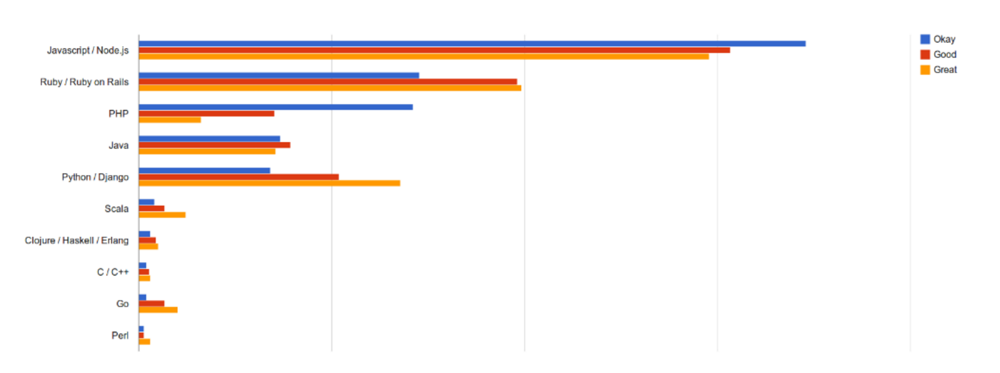

# [WIP]
# Why Scala?

Before starting working at *Nozzle* we worked on a start-up for hosting and serving videos.
We wrote the back-end in *node.js* and it costed us a year of work and countless re-factors.

When we had to pick up a new language for *Nozzle* we decided that we still wanted expressiveness and flexibility, but also robustness and type safety.
Also, we realized we could not afford re-factoring lots of different projects when we found a bug in a core module.

## Cons 

Scala is not a very used programming language, especially when talking about start-ups.

People use to think that developing in Scala is slow and the learning curve is steep.

## Pros

Although it could be seen as a hipster choice, we think *Scala* we have good reasons to stick with it.
It probably takes more time to ship code, but it takes less time to ship code *that works*.
Code written in *Scala* is generally more correct and clear, more easily testable.
Furthermore, its interoperability with *Java* is handy in lots of situations.